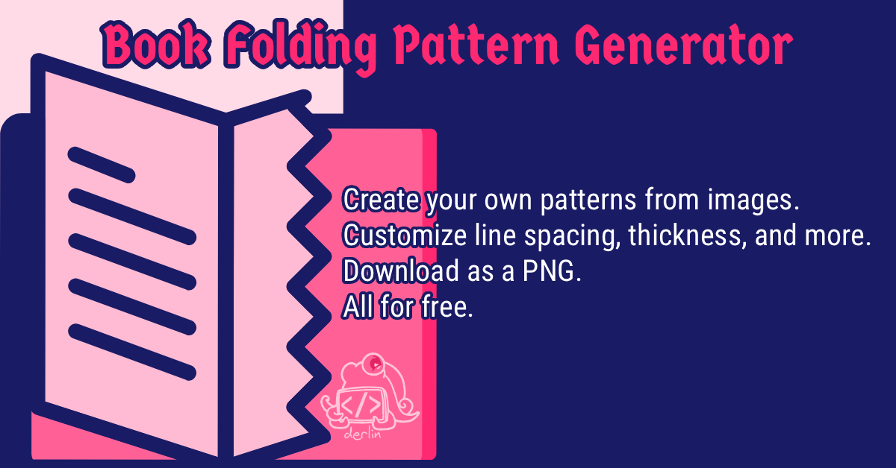

# Book Folding Pattern Generator

Transform a (black/white) image into a book folding pattern. Get information about the number of lines, segments, and pages needed for your project.
Easily export it to PNG with helper lines, horizontal stretching, and padding.

I won't list all the features here, just try it out!

---

## Development

To run the project locally:

1.  Install dependencies: `npm install`
2.  Start the development server: `npm run dev`
    The application will be available at `http://localhost:5173` (or another port if 5173 is in use).

To build the project for deployment as a static application, use `npm run build` instead.
The build artifacts will be generated in the `dist/` directory. These files can be served by any static file server.
